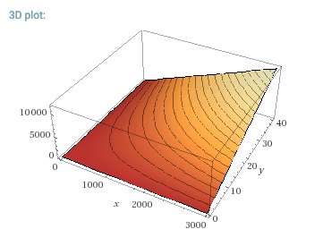
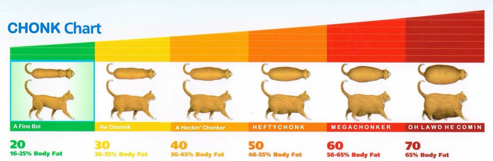

# chonkbot

How chonky are your pull requests?

## How is chonkyness calculated?

The formula is: `c = xy/10`

where:

`c` = chonkiness

`x` = the sum of additions and deletions

`y` = the number of files changed

This is visually represented by the 'chonk landscape' below:

## What is a chonk?

